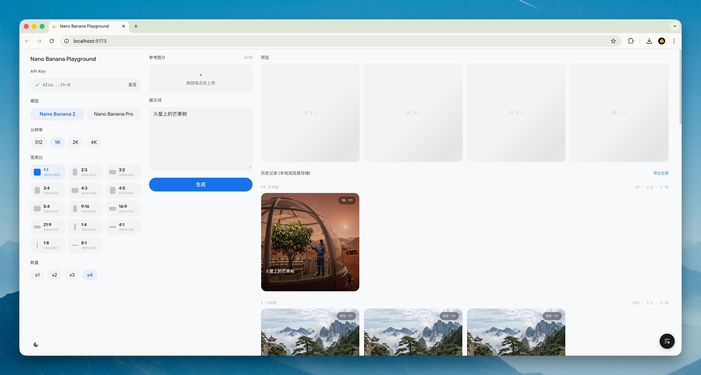

# Nano Banana Playground

A pure frontend playground for Gemini and GPT Image generation. No backend — your API keys stay in the browser.



## Features

### Design

Restrained **Linear / Notion-style** chrome: warm-stone neutral palette with a single subtle accent (indigo by default, 7 presets), 1px hairline borders, 6–10px radii, and dense 13px type. Typography pairs **Roboto** (body and headings) with **Roboto Mono** for numeric/metadata runs. Lucide icon set, no component library.

### Models & Output

- **Nano Banana 2** (`gemini-3.1-flash-image-preview`), **Nano Banana Pro** (`gemini-3-pro-image-preview`), and **GPT Image 2** (`gpt-image-2`) — switched via a segmented control, with per-model defaults for resolution, aspect ratio, and reference-image limits
- Resolution: 512 / 1K / 2K / 4K (subset per model)
- Up to 14 aspect ratios (1:1 to 8:1) rendered as glyph tiles with a live pixel-size readout
- Batch generation up to 4 images at once
- Real-time cost estimate before you generate (USD)

### Structured Prompts

Flip between plain text and a structured form that breaks your prompt into discrete fields: subject, action, scene, composition, style, lighting, color palette, text overlay, and constraints. Structured labels (风格, 构图, 光影, …) are highlighted inline in the textarea.

The **AI Augment** button calls Gemini (or GPT-5.4 mini for OpenAI flows) to expand your idea into multiple polished prompt schemes. Pick one, edit it, or hit **各生成一张** to produce all variants in a single batch.

### Reference Images

- Drag files from your desktop, paste from the clipboard, or drag images out of the history grid
- Per-model max (e.g. 14 for Nano Banana 2); reference + character image slots are unified in the UI

### History & Export

- Every generated image is saved locally in IndexedDB — no account, no server
- History grouped by batch, with timestamp, resolution, aspect ratio, and count
- **Export ZIP** bundles everything for local archiving
- Infinite scroll loads older batches on demand

### Image Detail

Full-screen viewer with a grid-background canvas:

- Wheel zoom, click-and-drag pan, double-click or <kbd>0</kbd> to reset, pinch on touch
- Keyboard <kbd>←</kbd> / <kbd>→</kbd> navigation, <kbd>Esc</kbd> to close
- Side-by-side reference image comparison
- Download PNG, copy image, copy prompt, add to reference, regenerate
- Metadata panel: model · model ID · resolution · aspect ratio · seed / cost / token usage · batch position · creation time

### Theming

- Light / Dark / System modes
- 7 accent presets (Indigo · Emerald · Amber · Rose · Orange · Violet · Mono), swapped via CSS variables

## Getting Started

**Prerequisites:** Node.js 18+, a [Gemini API key](https://aistudio.google.com/apikey) and/or an OpenAI API key

```bash
# Install dependencies
npm install

# Start dev server
npm run dev
```

Open http://localhost:5173, paste your API key, and start generating.

```bash
# Build for production
npm run build

# Preview production build locally
npm run preview

# Run tests
npm test
```

## Deploy

Deployed to Cloudflare Pages via GitHub Actions on every push to `main`.

Live: https://banana.jixiang.dev
