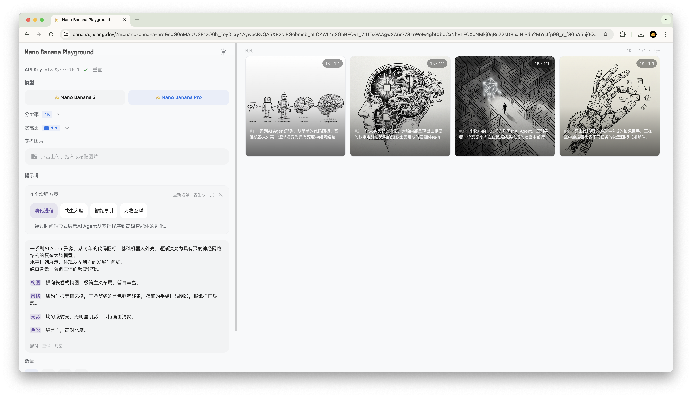

# Nano Banana Playground

A pure frontend playground for Gemini image generation. No backend — your API key stays in the browser.



## Features

### Design
Built on **Google Material Design 3** end-to-end: dynamic color roles (`primary`, `surface`, `outline`, etc.), MD3 type scale (Display / Headline / Title / Body / Label), 4pt grid spacing, correct state layers (hover 8%, pressed 12%), and Material Symbols Rounded icons — all hand-implemented without any component library.

### Models & Output
- **Nano Banana 2** (`gemini-3.1-flash-image-preview`) and **Nano Banana Pro** — switch models instantly
- Resolution: 512 / 1K / 2K / 4K
- 14 aspect ratios (1:1 to 8:1) with pixel dimensions preview on hover
- Batch generation up to 4 images at once
- Real-time cost estimate before you generate (USD)

### Structured Prompts
Flip between plain text and a structured form that breaks your prompt into discrete fields: subject, action, scene, composition, style, lighting, color palette, text overlay, and constraints. Works for both generation and editing modes.

The **AI Augment** button calls Gemini to expand your idea into 3 polished prompt schemes. You can pick one, edit it, or hit **Generate one per scheme** to produce all variants in a single batch.


### Reference Images
- Drag files from your desktop or from the history grid — both work
- Up to 14 reference images (model limit)
- Drag history-generated images directly into the reference slot

### History & Export
- Every generated image is saved locally in IndexedDB — no account, no server
- History grouped by batch, with timestamp, resolution, aspect ratio, and count
- **Export all** as a ZIP archive

### Image Detail
Full-screen viewer with:
- Pinch-to-zoom, scroll-wheel zoom, click-and-drag pan, double-click to reset
- Keyboard arrow navigation through history
- Side-by-side reference image comparison
- Download (PNG), copy to clipboard, copy prompt, add to reference
- Full metadata: model, resolution, aspect ratio, prompt, creation time

## Getting Started

**Prerequisites:** Node.js 18+, a [Gemini API key](https://aistudio.google.com/apikey)

```bash
# Install dependencies
npm install

# Start dev server
npm run dev
```

Open http://localhost:5173, paste your Gemini API key, and start generating.

```bash
# Build for production
npm run build

# Preview production build locally
npm run preview
```

## Deploy

Deployed to Cloudflare Pages via GitHub Actions on every push to `main`.

Live: https://banana.jixiang.dev
